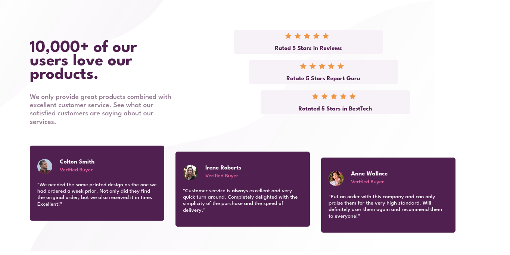

# Frontend Mentor - Solución al Social proof section

Esta es una solución al [Desafío del componente social proof section en Frontend Mentor](https://www.frontendmentor.io/challenges/social-proof-section-6e0qTv_bA).

## Tabla de contenido

- [Visión general](#visión-general)
  - [El reto](#el-reto)
  - [Capturas de pantalla](#capturas-de-pantalla)
  - [Enlaces](#enlaces)
- [Mi proceso](#mi-proceso)
  - [Construido con](#construción)
  - [Lo que aprendi](#lo-que-aprendi)
  - [Desarrollo continuo](#desarrollo-continuo)
  - [Recursos útiles](#recursos-útiles)
- [Autor](#autor)

## Visión general

### El reto

Los usuarios deben ser capaces de:

- Ver el diseño óptimo en función del tamaño de la pantalla de su dispositivo
- Ver los estados hover de los elementos interactivos

### Capturas de pantalla

- Escritorio



- Móvil


### Enlaces

- URL de la solución (Frontend Mentor): [Solución en Frontend Mentor](https://www.frontendmentor.io/solutions/accessibility-flexbox-position-gridlayout-mobilefirst-mediaqueries-wR0XUhu7zk).
- URL del sitio en vivo: [En vivo](https://boudgnosis.github.io/social-proof-section-master/)

## Mi Proceso

### Construción

- HTML semántico
- Variables CSS
- Flexbox
- GRID
- Accesibilidad web
- Media queries 
- Responsive desing
- Mobile first

### Lo que aprendi

Aprendi a crear un layout básico con **CSS GRID** y a poder posicionar los lementos usando esto mismo.

```css
body {
		display: grid;
		grid-template-columns: repeat(3, 1fr);
		grid-template-rows: repeat(2, 1fr);
}
```

```css
.container {
		grid-column: 1 / 3;
}
```

### Desarrollo continuo

Me costó más de lo normal hacer el responsibe desing partiendo de un mobile first y es algo que tendré que estudiar porque hay muchos
aspectos de esto que no tuve en cuenta y eso probablemente hicieron que me costara más, pero es algo que trabajaré.

### Recursos útiles

- [MDN Web Docs](https://developer.mozilla.org/es/) - Suelo usar este recurso porque explica muy bien todo además de que tiene una documentación muy amplia.
- [Grid CSS](https://lenguajecss.com/css/maquetacion-y-colocacion/grid-css/) - Buena explicación con ejemplos.
-[w3 School](https://www.w3schools.com/css/css_grid.asp) - Explica de forma breve pero de forma muy clara.

## Autor

- Codepen - [@boudgnosis](https://codepen.io/boudgnosis)
- Frontend Mentor - [@boudgnosis](https://www.frontendmentor.io/profile/boudgnosis)
- Twitter - [@juan_ariasd](https://twitter.com/juan_ariasd)   
- Dev - [@juan_duque](https://dev.to/juan_duque)
- Linkedink - [juan pablo arias duque](https://www.linkedin.com/in/jpariasduque/)
